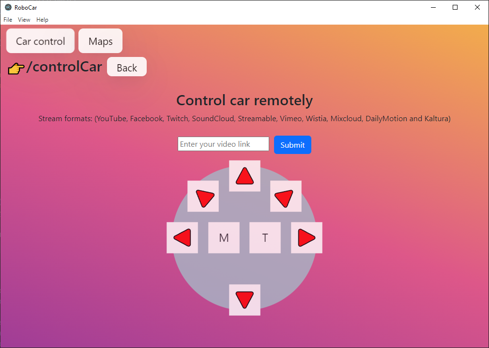

# RoboCar's App



## About 
This application is built  on a bunch of frameworks(react + electron). [Electron React Boilerplate](https://electron-react-boilerplate.js.org/ "A Foundation for Scalable Cross-Platform Apps") was used as a base of the app.

## Install
Install dependencies:

```bash
npm install
npm install husky
```

## Development mode

```bash
npm run start
```

## Packaging for production

```bash
npm run package
```


